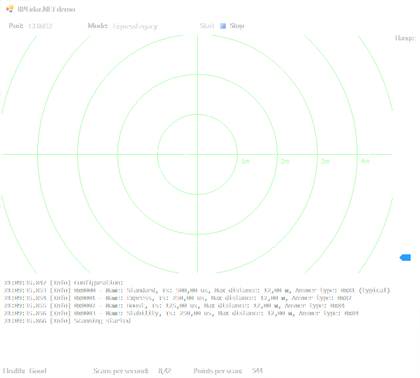

# RPLidar.NET

This a .NET Standard 2.0 library written in C# to interface with Slamtech RPLidar.
Tested with:
 - Model A1
 - Windows 10
 - Raspberry Pi 4 (.NET Core 3.0 preview 8 on Raspbian Buster)

I took Python RPLidar implementation as a reference in some places:
https://github.com/Roboticia/RPLidar

Otherwise it's based on the [Slamtech Interface Protocol and Application Notes for A series](https://www.slamtec.com/en/Support#rplidar-a-series).

It supports commands:
 - Get info
 - Get health
 - Get configuration
 - Control motor via DTR signal
 - Start legacy scan 
 - Start express legacy scan
 - Stop scan
 - Reset
 
All functions are blocking, except scan and measurements fetching functions which just get as much data as are in SerialPort buffer.

It comes with Demo application which is written for Windows Forms running on .NET Core:

